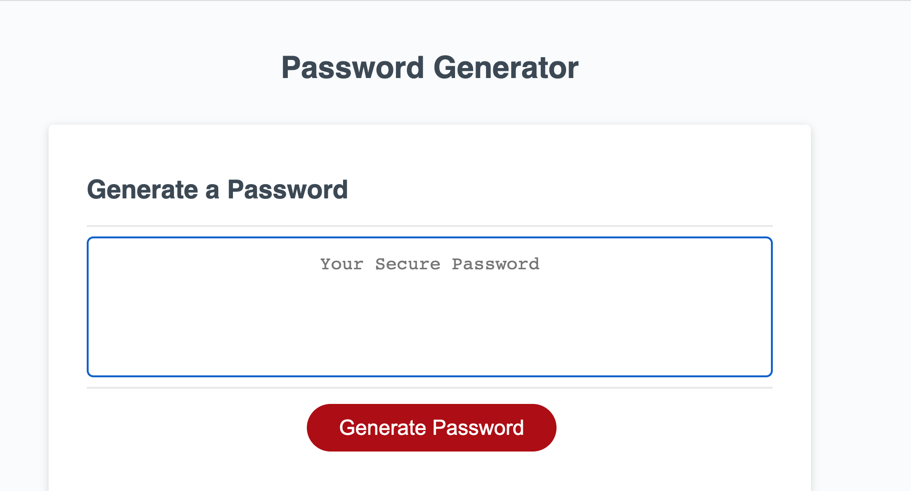

# Javascript-Password-Generator

## Description
I have created a password generator for the end user to access sensitive data. 
A random password (that meets specific criteria) automatically generates, so that the end user is provided with a strong password for better security. 

### **What I used**:computer::eyeglasses:
-javascript
--for loops 
---if statemets 

#### Demo :unlock:
github - https://ashmo91388.github.io/Javascript-Password-Generator/

